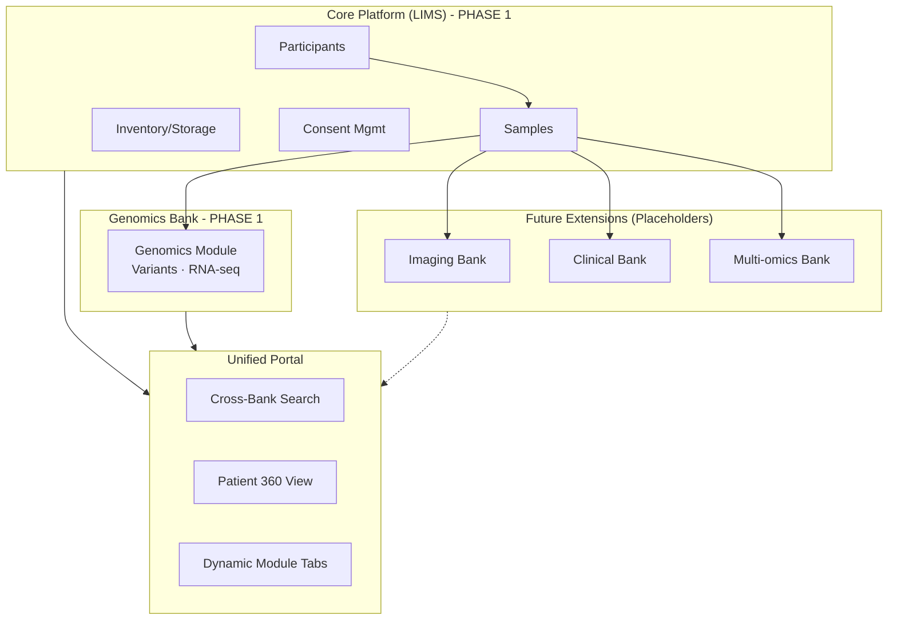

# Unified Biobank & Multi-Bank Data Platform — Implementation Plan

**Focus: Phase 1 — Genomics Core with Multi-Bank Extensibility**

A modular platform designed to manage biological samples and their associated data. While Phase 1 focuses on **Genomics**, the architecture is built to support future "Banks" (Imaging, Clinical, Proteomics, etc.) as modular extensions.

---

## High-Level Architecture: Modular "Hub & Spoke"

---

## Design Strategy: "Ready for Anything"

To ensure the system is "suitable for other banks" later, we will implement:
1.  **Extensible Metadata**: The `SAMPLES` and `PARTICIPANTS` tables will use PostgreSQL `JSONB` for bank-specific attributes.
2.  **Generic Linking**: All data (Genomic files, future Images, future Records) links to a `Sample_ID` or `Participant_ID`.
3.  **UI Modularity**: The "Patient 360" view will use a tabbed interface. In Phase 1, the "Genomics" tab is active; other tabs (Imaging, Clinical) will show "Feature Coming Soon" placeholders.

---

## Proposed Changes

### 1. Core Hub (Specimen Management)
The foundation remains the physical sample. Even if we only have Genomics data now, we track the source (e.g., "DNA Sample #123 extracted from Blood Vial #456").

#### Participant & Sample Models
- `Participant`: Basic clinical metadata placeholders.
- `Sample`: Type (Blood, Tissue, DNA), Status, and Storage location.

---

### 2. Genomics Bank (Phase 1 Priority)
- **Ingestion**: VCF and Expression matrix parsers.
- **Visualization**: Variant tables, Oncoplots, and Gene expression charts.
- **Search**: Search by Gene, Variant, or Cancer Type.

---

### 3. Future Bank Placeholders
- **UI Placeholders**: "Imaging" and "Clinical" tabs in the patient profile.
- **API Architecture**: Service-oriented structure where a new `imaging_service.py` can be plugged in without touching the core logic.

---

## Phased Execution Plan (Revised)

### Phase 1: Core Hub & Genomics (Days 1–10)
- [ ] **Database**: Participants, Samples, Storage, and Genomic Data tables.
- [ ] **Backend**: Participant/Sample CRUD + Genomics parsing (VCF/CSV).
- [ ] **UI**: Participant List & "Patient 360" dashboard.
- [ ] **UI**: Active "Genomics" tab with Variant Browser and Mutation Charts.
- [ ] **UI**: Visual Inventory grid for physical samples.

### Phase 2: Enhanced Genomics & Placeholders (Days 11–15)
- [ ] **Genomics**: Pathway Network (Cytoscape) and Expression Heatmaps.
- [ ] **Search**: Global search across Participants, Samples, and Genes.
- [ ] **UI Placeholders**: Add "Imaging" and "Clinical" tabs to the UI with professional "Placeholder" designs.
- [ ] **Architecture**: Document the "Bank Extension" API for future developers.

### Phase 3: Polish & Deployment (Days 16–20)
- [ ] **Security**: JWT Auth and Row-Level Security.
- [ ] **Documentation**: API docs for the Core and Genomics modules.
- [ ] **Deployment**: Docker Compose for easy local/server setup.

---

## Verification Plan

### Automated Tests
- `pytest`: Ensure samples can be created and linked to genomic data.
- `Cypress`: Verify that clicking a "Future Bank" placeholder shows the correct "Coming Soon" UI.

### Manual Verification
- Verify the "Patient 360" view shows the link between a physical Sample and its Genomic results.
- Ensure the UI feels like a complete "Biobank" platform, even if only the Genomics module is currently populated.
